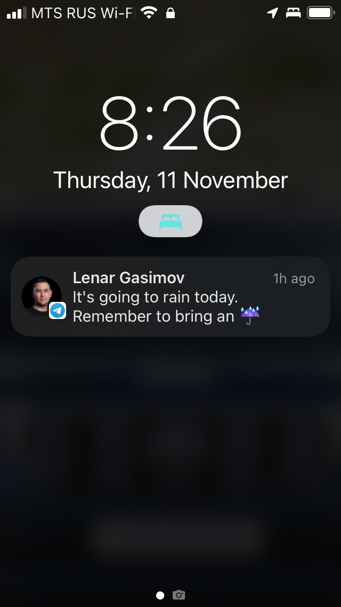
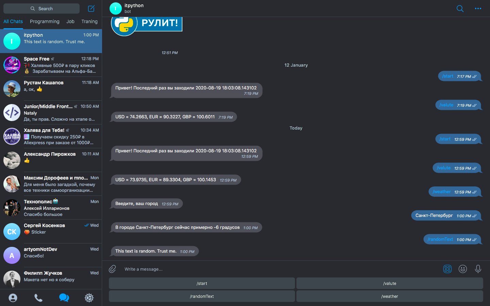

<h1 align="center">Lenar’s bot
    
</h1>

    
    
    

## Features

🔮 Wrote a bot from which you can find out the weather in any city, the exchange rate of foreign currencies. If you 
write "Guido" in response, the bot will send a sticker that saying "Python rules".

Check out the bot at [lenar's bot](https://t.me/itpytonbot).

- Python 3
- Telebot
- PostgreSQL
- Schedule

---

 
  

<b>Lenar Gasimov</b> Python developer | Python, Django, Flask.

    

